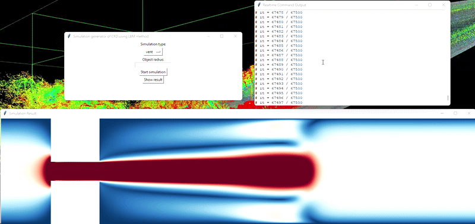
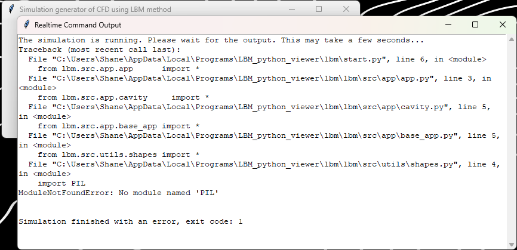

# Project Name
[](#prerequisites)
[](https://github.com/Shaneosaure/LBM_python_viewer/actions/workflows/Build%20and%20Release.yml) 
[](https://github.com/Shaneosaure/LBM_python_viewer/actions/workflows/github-code-scanning/codeql) 
[](https://github.com/Shaneosaure/LBM_python_viewer/releases/latest)
[](https://github.com/Shaneosaure/LBM_python_viewer/commits/main)
[](https://github.com/Shaneosaure/LBM_python_viewer/releases/latest)
[](https://github.com/Shaneosaure/LBM_python_viewer/blob/main/LICENSE.txt)

The LBM Python Viewer is a Python GUI application utilizing Tkinter to generate and visualize Computational Fluid Dynamics (CFD) simulations with the Lattice Boltzmann Method (LBM). The tool offers a user-friendly interface for creating and visualizing LBM simulations, supporting both preset and customizable scenarios. Simulations are presented through GIF animations.

## Table of Contents

- [Prerequisites](#prerequisites)
- [Installation](#installation)
- [Usage](#usage)
- [Troubleshooting](#troubleshooting)
- [Source](#source)
- [License](#license)

## Prerequisites

This project has been tested using Python 3.11.x, so we recommend using this version for best performance.

## Installation

### With setup.exe

If you want to install the project easily, you can use the installer provided in releases tab.

You need to run the following command after the installation is done:
```bash
pip install -r https://raw.githubusercontent.com/Shaneosaure/lbm/master/requirements.txt
```

### From source

To set up the LBM Python Viewer, follow these steps:

1. Clone the project repository:

   ```bash
   git clone https://github.com/Shaneosaure/LBM_python_viewer
   cd LBM_python_viewer
   ```

2. Initialize submodules:

   ```bash
   git submodule update --init
   ```

3. Install Python dependencies:

   ```bash
   pip install -r lbm/requirements.txt
   ```

Now, the LBM Python Viewer is successfully installed on your local machine.

## Usage

Explain how to use your project, providing examples and details about key features.

```bash
# Example usage
python main.py
```

### Running example
<p align="center">
  
</p>

## Troubleshooting

If you have the following error: 
<p align="center">
  
</p>

You need to install the dependencies using the command provided in [Instructions-with-setup.exe](#with-setupexe)

## Source

This project is using the submodule "lbm," which is a fork of the existing project [https://github.com/jviquerat/lbm](https://github.com/jviquerat/lbm)

## License

This project is under the MIT license.
